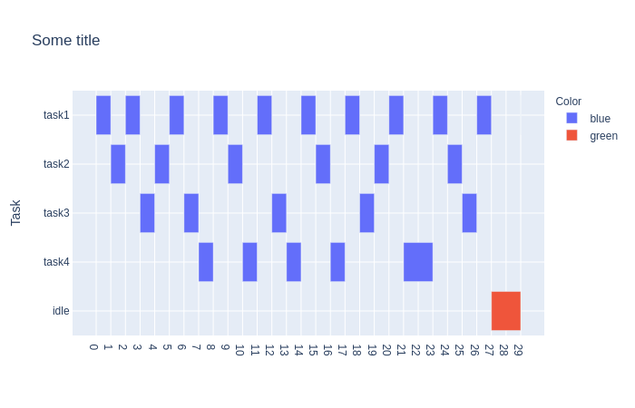

|Docs Badge| 

==================================
Welcome to YATSSS's documentation!
==================================

YATSS (Yet Another Task Scheduling Simulator).
Supported task scheduling algorithms: 

* `Rate Monotonic Scheduling (RMS) algorithm <https://en.wikipedia.org/wiki/Rate-monotonic_scheduling>`_;
* `Earliest Deadline First (EDF) algorithm <https://en.wikipedia.org/wiki/Earliest_deadline_first_scheduling>`_.

Creating the conda environment
==============================

::

    conda create --name yatss python=3.6
    conda activate yatss
    conda install pandas
    conda install pyyaml
    conda install plotly
    conda install sphinx
    pip install sphinx-rtd-theme
    pip install sphinx-autodoc

Installing and running
======================

::

    git clone 
    cd shed-learning
    python src/main.py example/testbench2.yaml

Running an example
==================

.. code-block:: bash

   >$ python src/main.py examples/wikipedia.yaml --ofile sched.yml
   checking the task list ... passed !
   The simulation time is: 40
   checking the scheduling list ... passed !

Task description YAML file
==========================

The following example from wikipedia describes a taskset of 3 tasks. 

The taskset attributes are: 

 * Mandatory: algo, tasks
 * Optional: None

The task attributes are: 

 * Mandatory: name, exec_time, deadline, period;
 * Optional: color.

.. code-block:: yaml
   :linenos:

      algo: 
      - edf
      - rms
      tasks:
        - name: p1
          exec_time: 1
          deadline: 8
          period: 8
        - name: p2
          exec_time: 2
          deadline: 5
          period: 5
        - name: p3
          exec_time: 2
          deadline: 10
          period: 10

Schedule YAML file
==================

The following example describes a taskset of 3 tasks. 

The taskset attributes are: 

 * Mandatory: algo, tasks
 * Optional: None

The task attributes are: 

 * Mandatory: name, exec_time, deadline, period;
 * Optional: color.

.. code-block:: yaml
   :linenos:

   sched:
   - color: blue
     jobs:
     - [ 2, 3]
     - [ 7, 8]
     - [16,17]
     - [23,24]
     - [31,32]
     name: p1
   - color: blue
     jobs:
     - [ 0, 2]
     - [ 4, 6]
     - [ 9,11]
     - [14,16]
     - [19,21]
     - [24,26]
     - [29,31]
     - [34,36]
     name: p2
   - color: blue
     jobs:
     - [ 3, 4]
     - [ 6, 7]
     - [11,13]
     - [21,23]
     - [32,34]
     name: p3
   - color: green
     jobs:
     - [ 8, 9]
     - [13,14]
     - [17,19]
     - [26,29]
     - [36,39]
     name: idle
   title: Some title

Indices and tables
==================

* :ref:`genindex`
* :ref:`modindex`
* :ref:`search`

   yatss/modules.rst
   

.. |Docs Badge| image:: https://readthedocs.org/projects/yatss/badge/?version=latest

:target: https://yatss.readthedocs.io/en/latest/?badge=latest
:alt: Documentation Status
