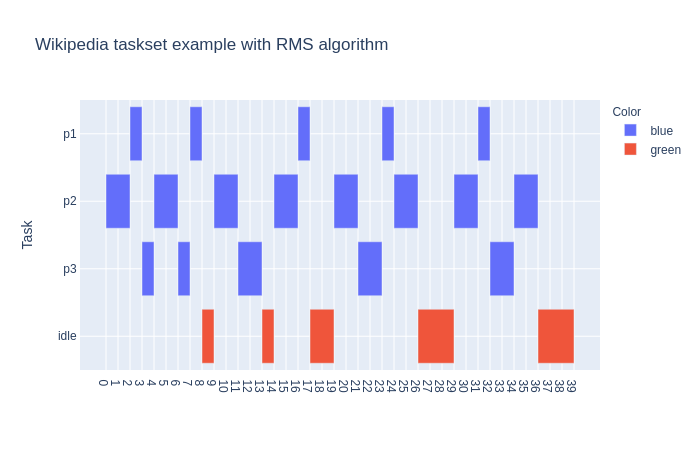
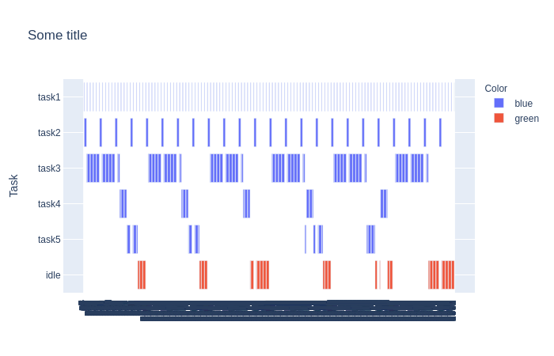
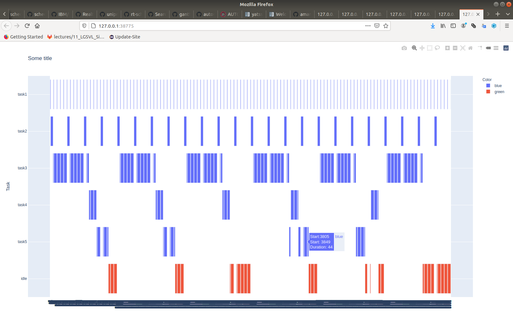

.. include:: ../../README.rst

Installing
==========

.. code-block:: bash

    conda create --name yatss python=3.6
    conda activate yatss
    git clone https://github.com/amamory-embedded/sched-learning.git
    cd shed-learning
    pip install -r requirements.txt

Examples and Usage
==================

Enter the following command to run an example:

.. code-block:: bash

   >$ python src/run_sched.py examples/wikipedia.yaml
   checking the task list ... passed !
   The simulation time is: 40
   checking the scheduling list ... passed !

These are the supported arguments:

::

    $ python src/run_sched.py -h
    usage: run_sched.py [-h] [--ofile OFILE] [-s SIM_TIME] [-v] [--sched [{rms,edf}]] file

    positional arguments:
      file                  input file describing the tasks to be scheduled

    optional arguments:
      -h, --help            show this help message and exit
      --ofile OFILE         output file with the resulting schedule. If not
                            defined, it will not be saved in a file
      -s SIM_TIME, --simtime SIM_TIME
                            The number of OS ticks to be simulated.
      -v, --verbose
      --sched [{rms,edf}]   list of supported task scheduling algoritms (default: rms)

It is also possible to just visualize an existing scheduling:

.. code-block:: bash

   >$ python src/show_sched.py examples/wikipedia-sched.yaml
   checking the task list ... passed !

It will open in the browser an image like this one.

Graphical Support
=================

YATSS generated gantt-link schedules like this one.

and it also has *hover* functionality, displaying the initial/final time and duration of a job.

File Formats
============

YATSS has an input file format to describe the task set to be scheduled
and an output file format for the resulting schedule. 
Both files are based on YAML format.

Input File: Task description YAML file
***************************************

The following example from `wikipedia <https://en.wikipedia.org/wiki/Rate-monotonic_scheduling>`_
describes a task set of 3 tasks, as presented in the following table. 

=======  ==============  ======
Process  Execution Time  Period
=======  ==============  ======
P1 	      1 	            8
P2 	      2 	            5
P3 	      2 	            10 
=======  ==============  ======

The task set attributes are: 

 * Mandatory: ``algo``, ``tasks``;
 * Optional: None

The task attributes are: 

 * Mandatory: ``name``, ``exec_time``, ``deadline``, ``period``;
 * Optional: color.

.. literalinclude:: wikipedia.yaml
  :language: yaml
  :linenos:

Output File: Schedule YAML file
*******************************

The following example describes a task set of 3 tasks. 

The schedule attributes are: 

 * Mandatory: ``algo``, ``sched``;
 * Optional: None

The task attributes are: 

 * Mandatory: ``name``, ``jobs``. Where ``jobs`` is a list of tuples of start and finish job intervals;
 * Optional: ``color``.

.. literalinclude:: wikipedia-sched.yaml
  :language: yaml
  :linenos:

API Doc
=======

* :ref:`genindex`
* :ref:`modindex`

.. toctree::
   :hidden:
   :caption: Contents
   :maxdepth: 3

